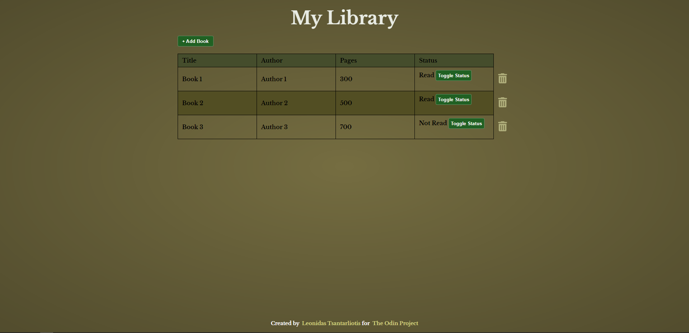

# Library

Live Demo:
https://leo-tsant.github.io/Library/

## Overview

This project was created for the [Library assignment](https://www.theodinproject.com/lessons/node-path-javascript-library) as part of [The Odin Project](https://www.theodinproject.com/). Features a web-based application, built using HTML, CSS, and JavaScript, that allows users to manage a personal library of books. Users can add, remove, and update book entries, and track their reading status.
